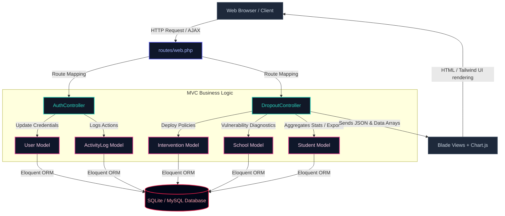
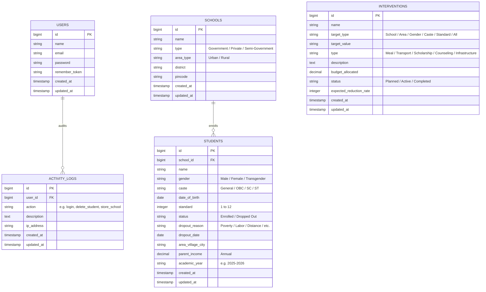
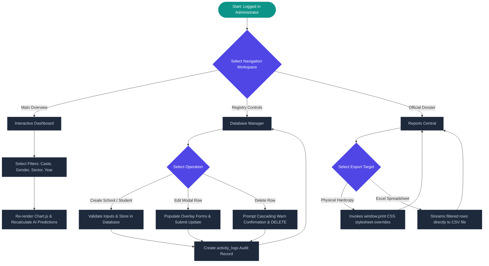

# Smart Education & Dropout Analytics Portal (EduKeep)

Welcome to the **Smart Education Portal (EduKeep)**, a state-of-the-art production-grade government analytics platform designed to analyze student dropout data, audit administrative activities, and simulate policy interventions to retain vulnerable student demographics.

Built on **Laravel 11**, this application features clean MVC architecture, bilingual support, responsive glassmorphic interfaces, live interactive dashboards powered by **Chart.js**, printable official dossiers, and audit trail timelines.

---

## 1. System Architecture

The application is structured around a classic MVC design patterns enhanced with localized translations and predictive SQL aggregation tools.



---

## 2. Entity-Relationship (ER) Diagram

The system employs five highly integrated database entities. Administrative activity logging tracks every data modification securely.



---

## 3. Core Administrative Flowchart

Administrators interact with three core workspaces: **Dashboard View** (dynamic filter graphs), **Reports Center** (dossier printing & CSV exporting), and **CRUD Database Manager**.



---

## 4. Complete Database Schema Details

### 4.1 Users Table (`users`)
- `id` (bigint, Primary Key, Auto-Increment)
- `name` (string)
- `email` (string, Unique)
- `password` (string)
- `remember_token` (string, Nullable)
- `timestamps` (`created_at`, `updated_at`)

### 4.2 Schools Table (`schools`)
- `id` (bigint, Primary Key, Auto-Increment)
- `name` (string): School Name
- `type` (string): Sector ("Government", "Private", "Semi-Government")
- `area_type` (string): Regional classification ("Urban", "Rural")
- `district` (string): District location
- `pincode` (string): 6-digit PIN
- `timestamps` (`created_at`, `updated_at`)

### 4.3 Students Table (`students`)
- `id` (bigint, Primary Key, Auto-Increment)
- `school_id` (bigint, Foreign Key constrained to `schools.id` cascading on delete)
- `name` (string): Student Name
- `gender` (string): ("Male", "Female", "Transgender")
- `caste` (string): ("General", "OBC", "SC", "ST")
- `date_of_birth` (date)
- `standard` (integer): Class level (1 to 12)
- `status` (string): ("Enrolled", "Dropped Out")
- `dropout_reason` (string, Nullable): Poverty, Commute Distance, Child Labor, etc.
- `dropout_date` (date, Nullable)
- `area_village_city` (string): Student Village / Hamlet
- `parent_income` (decimal, 10, 2): Annual parental income
- `academic_year` (string): ("2023-2024", "2024-2025", "2025-2026")
- `timestamps` (`created_at`, `updated_at`)

### 4.4 Interventions Table (`interventions`)
- `id` (bigint, Primary Key, Auto-Increment)
- `name` (string): Scheme Name
- `target_type` (string): target category ("School", "Area", "Gender", "Caste", "Standard", "All")
- `target_value` (string, Nullable): value identifier (e.g. "Female", "SC")
- `type` (string): scheme classification ("Meal", "Transport", "Scholarship", "Counseling", "Infrastructure")
- `description` (text, Nullable)
- `budget_allocated` (decimal, 15, 2)
- `status` (string): ("Planned", "Active", "Completed")
- `expected_reduction_rate` (integer): Percentage efficacy
- `timestamps` (`created_at`, `updated_at`)

### 4.5 Activity Logs Table (`activity_logs`)
- `id` (bigint, Primary Key, Auto-Increment)
- `user_id` (bigint, Foreign Key constrained to `users.id` setting null on delete, Nullable)
- `action` (string): ("login", "logout", "delete_student", "store_school", "profile_update", etc.)
- `description` (text)
- `ip_address` (string, Nullable)
- `timestamps` (`created_at`, `updated_at`)

---

## 5. Installation & Setup Instructions

### 5.1 System Prerequisites
Ensure you have the following installed on your machine:
- PHP version `>= 8.3`
- Composer package manager
- Node.js & NPM

---

### 5.2 Option A: Standard SQLite Setup (Recommended / Fastest)
SQLite is configured by default for zero-setup local execution.

1. **Clone the repository and enter the directory**:
   ```bash
   cd c:\Users\swati\Desktop\SmartEducation\caproject
   ```

2. **Install composer and front-end dependencies**:
   ```bash
   composer install
   npm install
   ```

3. **Verify and Configure Environment (`.env`)**:
   Ensure `.env` contains the SQLite connection settings:
   ```env
   DB_CONNECTION=sqlite
   ```
   *(Note: The SQLite database file will automatically initialize under `database/database.sqlite`).*

4. **Run Database Migrations & Rich Mock Seeding**:
   This runs our customized migrations (adding the new demographic fields and activity log tables) and seeds 1,600 heavily weighted socio-economic student records:
   ```bash
   php artisan migrate:fresh --seed
   ```

5. **Build Front-end Assets**:
   ```bash
   npm run build
   ```

6. **Serve the Application**:
   Start the Laravel local server:
   ```bash
   php artisan serve
   ```
   Open your browser and navigate to `http://127.0.0.1:8000`. 
   - **Log in credentials**: `admin@edukeep.gov.in`
   - **Password**: `password123`

---

### 5.3 Option B: MySQL Database Setup (Alternative)
To connect the application to a local or production MySQL server:

1. **Create Database**:
   Log into your MySQL server and create a blank database:
   ```sql
   CREATE DATABASE smart_education CHARACTER SET utf8mb4 COLLATE utf8mb4_unicode_ci;
   ```

2. **Modify Environment File (`.env`)**:
   Open `.env` and adjust the database configurations:
   ```env
   DB_CONNECTION=mysql
   DB_HOST=127.0.0.1
   DB_PORT=3306
   DB_DATABASE=smart_education
   DB_USERNAME=your_mysql_username
   DB_PASSWORD=your_mysql_password
   ```

3. **Run Composer and NPM installs** (if not already done):
   ```bash
   composer install
   npm install
   ```

4. **Run Fresh Migrations & Seeding**:
   ```bash
   php artisan migrate:fresh --seed
   ```

5. **Build and Serve**:
   ```bash
   npm run build
   php artisan serve
   ```
   Navigate to the local serve port (`http://127.0.0.1:8000`) and sign in using the seed details (`admin@edukeep.gov.in` / `password123`).
